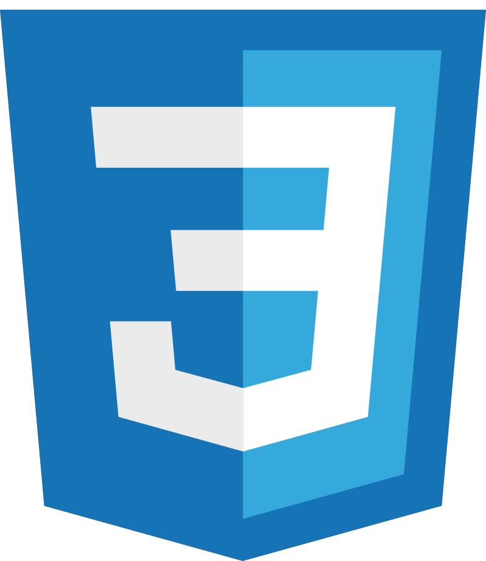
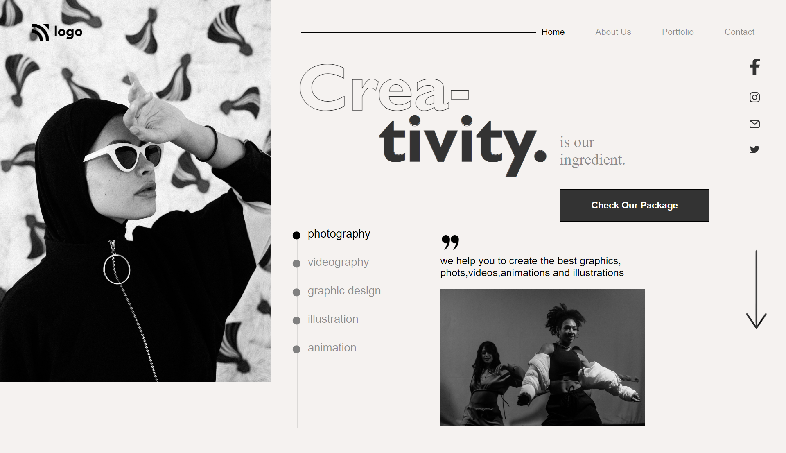

# Project-14 HTML  and CSS 

## Hi, I'm Shyam Tala! 👋

## Screenshots

>I Deployed my Site on Netlify and Vercel. so you can check it out 👇
  [https://bussiness-dev.netlify.app](https://bussiness-dev.netlify.app)
  [https://assignment-14.vercel.app/](https://assignment-14.vercel.app/)

## What I Learned from this Project?

 
- I learned about flex-box
- I learned about how can i fixed element at fixed position
- I learned about box-shadow and  -webkit-text-stroke

## This Project took around 03:00 Hours to complate.

## Author

- [@shyamtala](https://github.com/shyamtala003)

